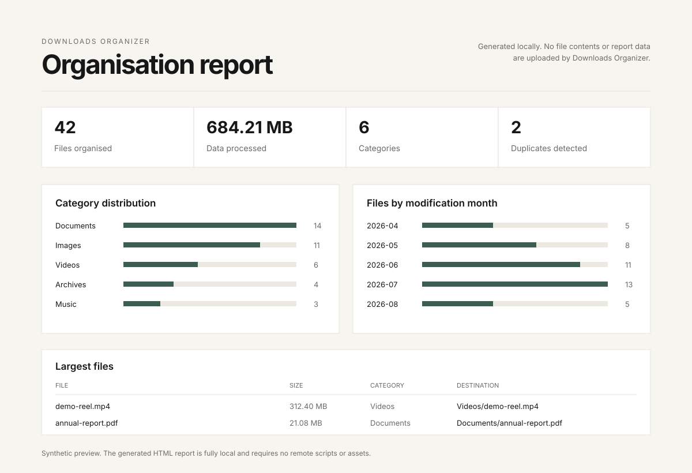

# Downloads Organizer

**A small, local-first CLI for turning a crowded Downloads folder into a clean, predictable structure.**

[](https://www.python.org/)
[](LICENSE)

Downloads Organizer sorts files into sensible categories, detects duplicates, handles filename collisions, and generates useful JSON and HTML reports. It works entirely on your machine and is deliberately conservative around destructive actions.

```text
$ downloads-organizer --dry-run

=== Downloads Organizer ===
Source: ~/Downloads
Destination: ~/Downloads/Organized
Mode: dry run (no files will be changed)

Planned operations:
Would move: annual-report.pdf -> .../Organized/Documents/annual-report.pdf
Would move: headshot.jpg -> .../Organized/Images/headshot.jpg
Duplicate retained: invoice.pdf -> .../Organized/Documents/invoice.pdf

=== Organization Summary ===
Total files processed: 42
Duplicates found: 2
Duplicates deleted: 0
Total size processed: 684.21 MB
```

> **Start with `--dry-run`.** It previews the organisation without creating, moving, or deleting anything.



*The preview above uses synthetic filenames and data, but mirrors the generated report layout.*

## What it does

By default, files in `~/Downloads` are organised into `~/Downloads/Organized` using broad categories such as Documents, Images, Music, Videos, Archives, Executables, Scripts, and Miscellaneous.

It also:

- detects identical destination files using SHA-256 hashing
- keeps detected duplicates by default
- deletes confirmed duplicates only when `--delete-duplicates` is explicitly supplied
- safely renames filename collisions when the contents differ
- optionally creates `YYYY-MM` subfolders using each file's modification date
- accepts custom source and output folders
- supports optional JSON category configuration
- generates timestamped JSON and fully local HTML reports

Directories inside the source folder are left alone. Downloads Organizer operates on files in the selected source directory, not recursively through nested folders.

## Quick start

### Install directly from GitHub

```bash
python -m pip install git+https://github.com/ameersameerkhan/downloads-organizer.git
```

Then preview what would happen:

```bash
downloads-organizer --dry-run
```

When the preview looks right:

```bash
downloads-organizer
```

### Clone for development

```bash
git clone https://github.com/ameersameerkhan/downloads-organizer.git
cd downloads-organizer
python -m pip install -e ".[dev]"
python -m pytest -q
```

After installation you can use either the `downloads-organizer` command or `python main.py` from the checkout.

Python 3.10 or newer is required.

## Usage

```text
usage: downloads-organizer [-h] [--source SOURCE] [--output OUTPUT]
                           [--config CONFIG] [--dry-run]
                           [--organize-by-date] [--delete-duplicates]
                           [--version]
```

### Preview without changing anything

```bash
downloads-organizer --dry-run
```

### Organise by file type and month

```bash
downloads-organizer --organize-by-date
```

This produces paths such as:

```text
Organized/
├── Documents/
│   └── 2026-08/
├── Images/
│   └── 2026-08/
└── Miscellaneous/
    └── 2026-07/
```

### Use another folder

```bash
downloads-organizer --source ~/Desktop/inbox
```

The default output becomes `<source>/Organized`.

### Choose both source and output

```bash
downloads-organizer \
  --source ~/Desktop/inbox \
  --output ~/Documents/archive
```

### Remove confirmed duplicates

```bash
downloads-organizer --delete-duplicates
```

This is intentionally opt-in. Without the flag, duplicates are detected and reported but the source copy is retained.

## Duplicate and collision behaviour

Downloads Organizer treats two cases differently.

**Same filename, same contents**

The source file is reported as a duplicate. It remains untouched unless `--delete-duplicates` was explicitly enabled.

**Same filename, different contents**

The incoming file is preserved and given a numbered name such as `report_1.pdf` rather than overwriting the existing file.

## Custom categories

Built-in categories require no configuration. To override them, provide a JSON file:

```json
{
  "categories": {
    "Documents": [".pdf", ".docx", ".txt", ".md"],
    "Images": [".jpg", ".jpeg", ".png", ".webp"],
    "Design": [".fig", ".sketch"]
  },
  "fallback": "Miscellaneous"
}
```

Run it with:

```bash
downloads-organizer --config examples/categories.json
```

When a custom config is supplied, its categories replace the built-in category map for that run.

## Reports

A normal run creates two timestamped reports in the output folder:

```text
report_20260817_124500.json
report_20260817_124500.html
```

The reports include:

- total files and data processed
- category distribution
- duplicates detected and removed
- largest files
- oldest files
- files grouped by modification month
- source and destination paths
- run duration

The HTML report is self-contained. It does not load Chart.js, fonts, analytics, or other remote assets.

## Safety

Downloads Organizer changes filesystem locations, so safety is treated as product behaviour rather than a disclaimer.

1. Source and destination paths are validated before organisation begins.
2. The complete operation plan is built before filesystem execution begins.
3. `--dry-run` performs no filesystem mutations and shows the planned operations.
4. Duplicate deletion is disabled unless explicitly requested.
5. Different files with the same name are renamed rather than overwritten.
6. Tests exercise real file operations inside isolated temporary directories, never a user's Downloads folder.

As with any file-management utility, keep appropriate backups for important data.

## Security and privacy

Everything happens locally.

- no file contents are uploaded
- no telemetry or analytics are collected
- no account or cloud service is required
- generated HTML reports require no network access
- filenames are escaped before being rendered into HTML reports

SHA-256 is used only to compare candidate duplicates. It is not presented as a security or integrity guarantee for your broader filesystem.

## Platforms

The implementation uses Python's platform-neutral `pathlib` and filesystem APIs. The automated test matrix verifies the project on **macOS, Windows, and Linux**, using Python 3.10 and Python 3.13 as the supported-range endpoints.

## Principles

**Safety first.** Previewing is easy and destructive behaviour requires explicit intent.

**Simple by default.** The standard Downloads folder and sensible categories work without configuration, while source, output, date structure, and categories remain configurable.

**Local first.** File organisation, duplicate detection, and reporting happen on your machine without telemetry or cloud dependencies.

## Project structure

```text
src/downloads_organizer/
├── cli.py          # command-line interface
├── config.py       # defaults and JSON configuration
├── organizer.py    # planning and filesystem execution
└── reporting.py    # local HTML report generation

tests/              # focused unit and filesystem integration tests
examples/           # optional configuration examples
assets/             # README visuals
```

Comments and module docstrings focus on behavioural invariants that matter to maintainers and coding agents, particularly around dry-run and destructive operations.

## Maintenance

Downloads Organizer is a **stable, low-maintenance open source project**. It is shared because it is useful, not because it is intended to become a large product or framework.

Issues are welcome as useful signals, but responses and feature work may be limited.

## License

Released under the [MIT License](LICENSE). You are free to use, modify, distribute, and build on it under the terms of that licence.

---

Built by [Ameer Sameer Khan](https://github.com/ameersameerkhan) and shared openly. If it is useful to you, make it yours.
